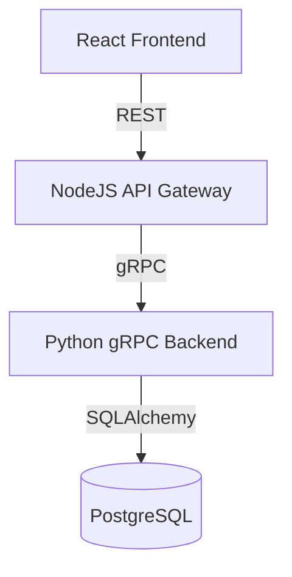

# Full-Stack Library Management System (POC)

A modern, highly-normalized Library Management System built with a **Python gRPC Backend**, **NodeJS API Gateway**, and **React (Vite) Frontend**. This project demonstrates advanced database normalization (3NF), centralized error handling (AOP), and containerized microservices.

## 🏗️ Architecture



### Key Technical Highlights
- **Normalized Schema**: Distinct entities for `Authors`, `Genres`, `BookMetadata`, and `BookCopies` to ensure data integrity and zero redundancy.
- **SOLID Design Principles**: 
    - **Single Responsibility (SRP)**: Logic is strictly decoupled into Repository (Data), Manager (Business), and Service (API) layers.
    - **Open/Closed (OCP)**: The validation system (e.g., `ILoanValidator`) allows new rules to be added without modifying existing code.
    - **Dependency Inversion (DIP)**: High-level business logic depends on abstractions rather than low-level database implementations.
- **Advanced OOP Implementation**: Intensive use of Classes, Abstract Base Classes (ABC), and Encapsulation to manage complex business domains.
- **AOP Error Handling**: Centralized gRPC Interceptor maps backend exceptions to standard gRPC status codes dynamically.
- **Microservices Architecture**: Fully Dockerized stack with bridge networking and automated service-to-service orchestration.
- **Modern Frontend Architecture**:
    - **Vite & React 18**: Leveraging the fastest build tools and modern React patterns.
    - **Centralized Service Layer**: Decoupled HTTP logic from UI components using an API repository pattern.
    - **Utility-First Styling**: Consistent, responsive UI built with Tailwind CSS.

---

## 📋 Prerequisites

Before you begin, ensure you have the following installed on your system:

1.  **Docker Desktop** (Version 20.10.0 or higher)
2.  **Docker Compose** (Version 2.0.0 or higher)

*No local Python, NodeJS, or PostgreSQL installation is required as everything runs inside containers.*

---

## 🚀 How to Run

Follow these steps to spin up the entire application stack:

### 1. Extract & Navigate
1.  Extract the provided `.zip` file to your preferred directory.
2.  Open a terminal and navigate to the extracted `poc` folder:
    ```bash
    cd path/to/extracted/poc
    ```

### 2. Launch & Seed
Run the following command to build, start, and automatically seed the application:
```bash
docker compose up -d
```
*Wait ~45 seconds. The system will automatically initialize the database and load the unique sample dataset.*

---

## 🌐 Component Access

Once the stack is running, you can access the components at the following URLs:

| Component | URL | Description |
| :--- | :--- | :--- |
| **Frontend UI** | [http://localhost:5173](http://localhost:5173) | Main dashboard for library operations. |
| **API Gateway** | [http://localhost:3001](http://localhost:3001) | RESTful entry point for external integrations. |
| **Backend gRPC** | `localhost:50051` | The core business logic layer. |

---

## 🧪 Exploration & Testing

### 1. Advanced Normalization
- Navigate to the **Add Book** form.
- Select from the pre-seeded **Authors** and multiple **Genres**.
- Add physical copies to see the `Available / Total` stock counts update in real-time.

### 2. Validation & Error Handling
- Attempt to create a member with an existing email (`alice.j@example.com`).
- Attempt to add a book with an existing ISBN.
- Observe the specific error messages propagated from the backend through the AOP interceptor.

## 🛠️ Internal Structure
- `backend/`: Python server using SQLAlchemy and gRPC.
- `gateway/`: NodeJS/Express server using `@grpc/grpc-js`.
- `frontend/`: React application using Vite and Tailwind CSS.
- `proto/`: Centralized `.proto` definitions for the entire stack.
